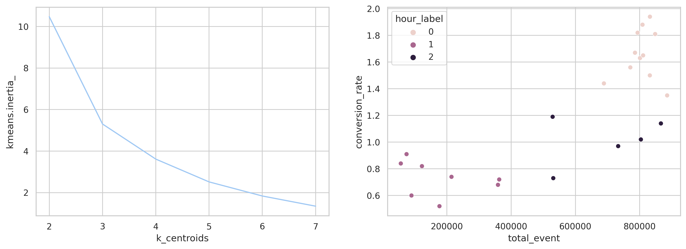

# Dự đoán hành vi mua hàng & khai phá nhóm hàng hóa thường xuyên trên dữ liệu lớn

### Nguồn dữ liệu:
Dữ liệu là các tương tác (click) của khách hàng trên một cửa hàng thương mại điện tử trong tháng 10 và tháng 11 năm 2019.
* Tổng số tương tác trong tháng 11/2019: 67.5 triệu tương tác.
* Các trường dữ liệu:
  - event_time: thời điểm xảy ra tương tác
  - event_type: Phân loại tương tác (view / cart / purchase)
  - product_id: 190.662 mã sản phẩm
  - category_id: 684 mã nhóm hàng
  - category_code: 129 tên nhóm hàng
  - brand: 4.201 tên hãng
  - price: giá sản phẩm
  - user_id: 3.696.117 mã khách hàng
  - user_session: 13.776.050 phiên truy cập, thay đổi khi khách hàng truy cập lại sau 1 khoảng thời gian dài.

src: https://www.kaggle.com/datasets/mkechinov/ecommerce-behavior-data-from-multi-category-store

### Vấn đề:
1. Theo từng phiên giao dịch, dựa vào giỏ hàng của khách hàng, dự báo khách hàng có mua hàng hay không để có khuyến mãi phù hợp.
2. Phân tích thị hiếu của khách hàng dựa trên nhóm hàng hóa thường xuyên.

### Hướng giải quyết:
* Do số lượng tương tác lớn (67.5 triệu click - ~10GB) do đó cần sử dụng công cụ khai phá dữ liệu phân tán và song song => lựa chọn Spark
* Dữ liệu dạng bảng => có thể sử dụng SQL trong môi trường Spark => tăng hiệu quả phân tích, giảm thời gian viết code, tận dụng được tốc độ của Spark
* Dự báo khách hàng có mua hàng hay không => khai thác đặc trưng dữ liệu theo phiên truy cập, có thể sử dụng các mô hình phân loại nông.
* Phân tích thị hiếu của khách hàng => khai thác đặc trưng dữ liệu theo mã khách hàng, sử dụng luật kết hợp (association rule)

### Công cụ/ngôn ngữ:
* Python, SQL
* PySpark
* Pandas
* Scikit-learn

### Vấn đề 1: dự báo hành vi mua hàng theo phiên truy cập:

1. Khai thác đặc trưng dữ liệu (feature engineering):

* Tổng số loại tương tác theo từng phiên:

| user_session	| cart	| purchase	| view	|
| -------------- | --- | --- | --- | 
| 000506dd-c8f9-46e2-895c-70a78cde8e17	| 1	| 0	| 14	|
| 001be2de-46a6-429d-b568-fd52d8af3f7d	| 1	| 1	| 1	|

* Tìm thời điểm bắt đầu, kết thúc và khoảng thời gian xảy ra phiên truy cập:

| user_session	| event_time_first	| event_time_last	| duration	|
| -------------- | --- | --- | --- | 
| eddf5cd0-c926-4920-a5b4-b2a65b7779b7	| 2019-11-17 01:29:09	| 2019-11-17 01:43:58	|	889	|
| 5c1e2dcb-f090-4014-b5f2-77db180404e5	| 2019-11-17 01:33:04	| 2019-11-17 02:21:00	|	2876	|

* Số loại hàng hóa/phân nhóm hàng hóa đã cho vào giỏ hàng:

| user_session	| num_distinct_cart_cat	| num_distinct_cart_product | 
| -------------- | --- | --- |
| f38c9080-eb01-4e42-94de-81201179c15d	| 16	| 36| 
| 13a0cd04-cbec-4842-866e-629f73fa66c0	| 15	| 50| 

* Tổng giá tiền của các sản phẩm xảy ra tương tác:

| user_session	| cart	| purchase	| view| 
| -------------- | --- | --- | --- | 
| 000506dd-c8f9-46e2-895c-70a78cde8e17	| 486.24	| 0.00	| 5589.57| 
| 001be2de-46a6-429d-b568-fd52d8af3f7d	| 8.21	| 8.21| 	8.21| 

* giá tiền trung bình các sản phẩm đã xem, đã mua, đã bỏ vào giỏ hàng; giờ bắt đầu phiên, ngày trong tuần

|user_session |mean_cart|mean_purchase|mean_view|hour|day_name|
| -------------- | --- | --- | --- | --- | --- | 
|eddf5cd0-c926-4920-a5b4-b2a65b7779b7|0.0      |0.0          |329.94   |8   |Sun     |
|5c1e2dcb-f090-4014-b5f2-77db180404e5|0.0      |0.0          |118.87   |8   |Sun     |

2. Phân tích dữ liệu:

* Hành vi mua hàng thường xảy ra vào cuối tuần, số đơn hàng vào thứ 6, thứ 7 và chủ nhật gấp đôi các ngày còn lại  trong tuần

<p align="center">

</p>

* Mặc dù số đơn hàng ban ngày rất lớn, số đơn hàng ban đêm cũng xảy ra với số lượng không nhỏ, tuy nhiên tỷ lệ mua hàng/xem giảm đáng kể so với ban ngày. Sự phân biệt này cho thấy các loại hàng hóa được xem vào ban đêm là các loại hàng hóa khách hàng quan tâm và còn đang cân nhắc; các loại hàng hóa được mua ban ngày là các loại hàng hóa cần thiết phải mua ngay.

<p align="center">

</p>

* Phân tích kmean cho thấy có thể chia khung giờ trong ngày thành 3 nhóm:
  - Giờ cao điểm: 4h - 14: lưu lượng truy cập cao, tỷ lệ chuyển đổi cao
  - Giờ trung bình: 3h, 15h - 18h: lưu lượng truy cập cao, tỷ lệ chuyển đổi thấp
  - Giờ thấp điểm: 19h - 2h: lưu lượng truy cập thấp, tỷ lệ chuyển đổi thấp

<p align="center">

</p>

<center>
  
|hour	|total_event	|conversion_rate	|hour_label|
| -------------- | --- | --- | --- |
|0	|89963	|0.60	|1|
|1	|176996	|0.52	|1|
|2	|359066	|0.68	|1|
|3	|529137	|1.19	|2|
|4	|688681	|1.44	|0|
|5	|770872	|1.56	|0|
|6	|800942	|1.63	|0|
|7	|810677	|1.65	|0|
|8	|848087	|1.81	|0|
|9	|831864	|1.94	|0|
|10	|808805	|1.88	|0|
|11	|793507	|1.82	|0|
|12	|785363	|1.67	|0|
|13	|831554	|1.50	|0|
|14	|885398	|1.35	|0|
|15	|866011	|1.14	|2|
|16	|803697	|1.02	|2|
|17	|733013	|0.97	|2|
|18	|531113	|0.73	|2|
|19	|362914	|0.72	|1|
|20	|214493	|0.74	|1|
|21	|122506	|0.82	|1|
|22	|74609	|0.91	|1|
|23	|56783	|0.84	|1|
  
</center>


* Phân phối tần suất tính theo logarit tự nhiên của khoảng thời gian mua hàng, tổng giá tiền sản phẩm đã xem, tổng giá tiền sản phẩm đã mua có dạng hình chuông và cân đối: 

<p align="center">

</p>


<p align="center">

</p>


<p align="center">

</p>

3. Xây dựng mô hình:


```bash
sql_script = \
"""
    SELECT
        ROUND(LOG(duration/c_view),2) AS log_avg_duration,
        ROUND(LOG(mean_cart),2) AS log_mean_cart,
        day_name,
        hour,
        num_distinct_category,
        num_distinct_cart_cat,
        num_distinct_cart_product,
        (CASE
            WHEN c_purchase <> 0 then 1
            ELSE c_purchase
        END) AS labels
    FROM session_insight
    WHERE user_session IS NOT NULL
    AND c_cart <> 0
    ;
"""
dataset = spark.sql(sql_script)
```
 * lựa chọn đặc trưng:
   - log_avg_duration: khoảng thời gian trung bình giữa các click: thời gian ngắn hoặc quá dài thể hiện sự không hứng thú hoặc không tập trung mua hàng.
   - log_mean_cart: giá tiền trung bình của các sản phẩm trong giỏ hàng thể hiện ngân sách của khách hàng. Không lựa chọn các tiêu chí giá tiền khác do có hiện tượng đa cộng tuyến.
   - day_name: ngày trong tuần xảy bắt đầu phiên. Cuối tuần có khả năng mua hàng cao hơn.
   - hour: giờ trong ngày bắt đầu phiên. Tỷ lệ mua mua hàng cao hơn vào các khung giờ cao điểm.
   - num_distinct_category: Số nhóm hàng hóa đã xem thể hiện thị hiếu của khách hàng tập trung hoặc phân tán.
   - num_distinct_cart_cat: Só nhóm hàng hóa khách hàng bỏ vào giỏ thể hiện nhu cầu thực của khách hàng tập trung hoặc phân tán.
   - num_distinct_cart_product: Số loại hàng hóa khách hàng bỏ vào giỏ thể hiện khách mua tiêu dùng (mua nhiều loại hàng hóa khách loại) hoặc mua buôn (mua số lượng nhiều cùng loại hàng hóa).
   - labels: nhãn huấn luyện mô hình.

* Áp dung MinMaxScaler với biến liên tục, OneHotEnconding với biến tổ.
* Train - test tỷ lệ 80 - 20, cân bằng tỷ lệ nhãn giữa train và test
* Sử dụng mô hình XGBoost Classifier với các thông số: learning_rate=0.1, max_depth=15
* Kết quả dự đoán: 
   - Đoán đúng phiên mua hàng / tổng số phiên mua hàng thật sự: 60.84%
   - Đoán đúng phiên mua hàng / tổng số dự đoán mua hàng: 64.97%
   - Đoán đúng phiên mua hàng & phiên không mua hàng / tổng số phiên: 73.24%

* Kêt luận: Với mục tiêu nâng cao hiệu quả chăm sóc khách hàng, mô hình đã dự đoán được xấp xỉ 2/3 số trường hợp khách hàng có khả năng mua hàng để có các chính sách ưu đãi hoặc bán kèm phù hợp.


### Vấn đề 2: khai phá nhóm hàng hóa thường xuyên:

loading...
